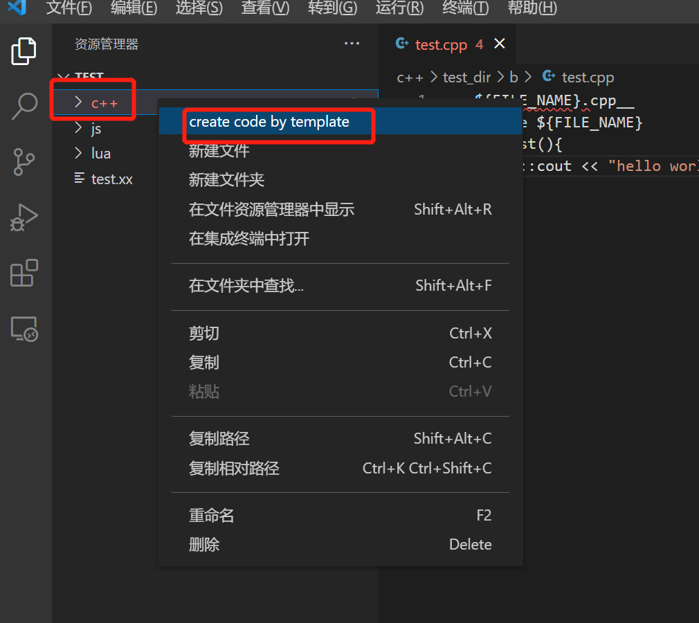
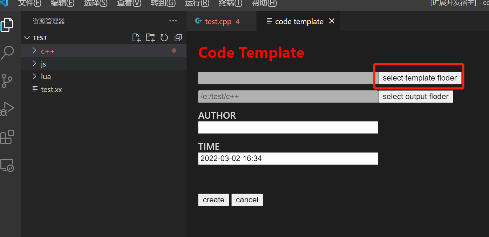
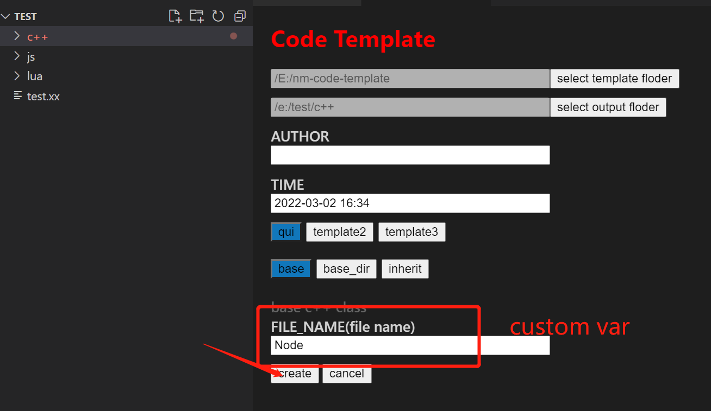
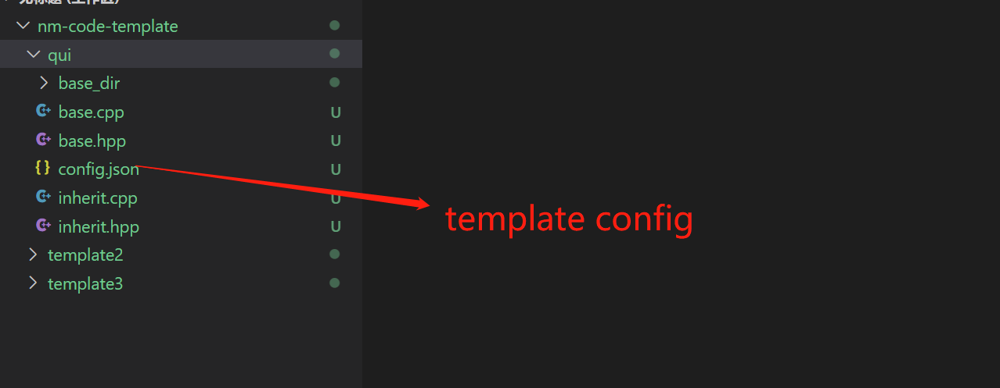

# codetemplate README

code template for vscode

## how to use

create code template 
1. select floder

2. setting code template floder

3. run


## write template
### template structure


### template config
* template
> create file list

* input
> config custom var
```json
[
    {
        "name":"base",
        "template":[
            {"name":"base.cpp", "type":"file"},
            {"name":"base.hpp", "type":"file"}
        ],
        "desc":"base c++ class",
        "input":[
            {
                "name":"FILE_NAME",
                "type":"input",
                "desc":"file name"
            }
        ]
    },
    {
        "name":"base_dir",
        "template":[
            {"name":"base_dir", "type":"dir"}
        ],
        "desc":"base c++ class",
        "input":[
            {
                "name":"FILE_NAME",
                "type":"input",
                "desc":"file name"
            }
        ]
    },
    {
        "name":"inherit",
        "template":[
            {"name":"inherit.cpp", "type":"file"},
            {"name":"inherit.hpp", "type":"file"}
        ],
        "desc":"base c++ class",
        "input":[
            {
                "name":"FILE_NAME",
                "type":"input",
                "desc":"file name"
            },
            {
                "name":"PARENT_NAME",
                "type":"select",
                "desc":"inherit parent name",
                "options":["QRef", "QShareRef"]
            }
        ]
    }
]
```

### template code
cpp example:
```c++
__${FILE_NAME}.cpp__
//
//  ${FILE_NAME}.cpp
//  desc
//
//  Created by ${AUTHOR} on ${TIME}.
#include "${FILE_NAME}.hpp"
NS_Q_BEGIN
${FILE_NAME}::${FILE_NAME}(){

}

${FILE_NAME}::~${FILE_NAME}(){
    
}
NS_Q_END
```

>__ __${FILE_NAME}.cpp__ __ this line will replace create file name, if you don't want to rename file ,just not write

### build-in var
* ${AUTHOR}
* ${TIME}


